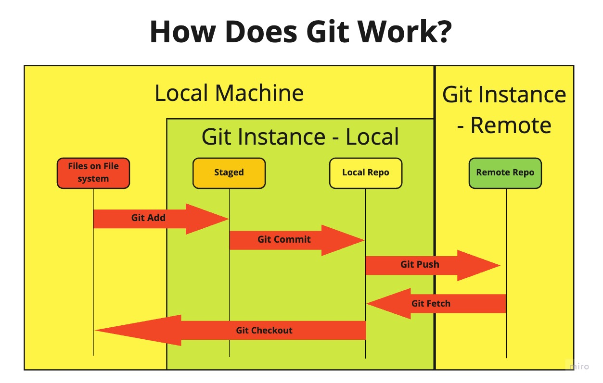

<< [Back to Root](../../README.md)

<< [Back to Diary](../README.md)

# Module 1

Module 1 is split into three sections
 - [Phase 1 - The Command Line](#phase-1---the-command-line)
 - [Phase 2 - Git Version Control](#phase-2---git-version-control)
 - [Phase 3 - Programming](#phase-3---programming)

## Phase 1 - The Command Line

During this phase of Module 1 we took a look at the basics of the CLI. We learnt command such as 

## Phase 2 - Git Version Control

To Do

### Challenges

***How Git Works***

We were set the challenge to diagram out how Git looks. My efforts:

## Phase 3 - Programming

To Do