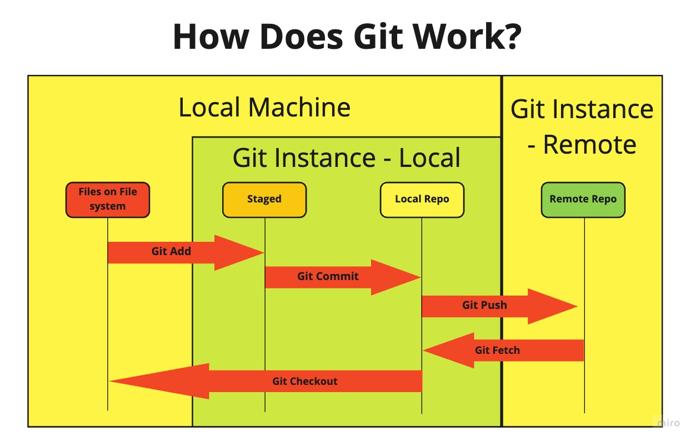

<< [Back to Root](../README.md)

<< [Back to Diary](README.md)

# Challenges

## Git Challengers

***How Git Works***

We were set the challenge to diagram out how Git looks. Here is my efforts




## Ruby Challengers

***Add a method to the person class***

``` ruby
 class Person
  def initialize(name, birthday, favourite_language)
    @name = name
    @birthday = birthday
    @favourite_language = favourite_language
  end

  def name
    return @name
  end

 end
